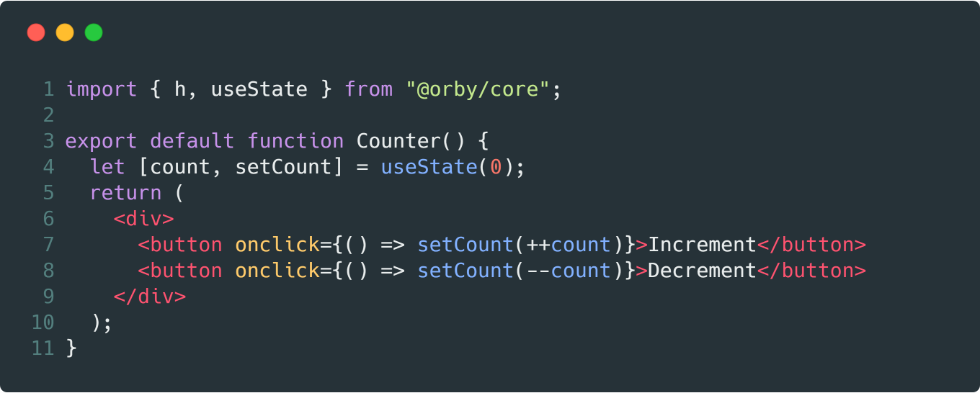

 

# @orby/core

**Orby** es una pequeño experimento de componentes funcionales basados en JSX y virtual-dom.

[](https://codesandbox.io/s/lpk8wy0njz)

> **Orby**, se encarga de mantener un estado único para cada componente funcional.

## Argumentos del componente

Un componente a base de **Orby**, puede leer 3 argumentos.

1. **props** : Propiedades asociadas al componente.
2. **state** : Controlador del estado del componente.
3. **context** : Contexto dado al componente desde un nivel superior.

```js
function Component(props,state,context){
  return <div>
      {props.children}
  </div>
}
```

### Props

Objeto de propiedades asociadas a la definición del componente:

```js
<Component id="10">
   <h1>sample</h1> 
</Component>

```
> las propiedades del componente serán `{id:"10",children:[...]}`

### State

El estado de cada componente se lee mediante el uso de `state.get()` y se actualiza mediante el uso de `state.set()`.

```js
function Component(props,state,context){
  return <button click={()=>state.set("Orby")}>
      Hi {state.get()||""}
  </button>
}
```

Puede usar `{set,get}` para acceder directamente a `state.set` y `state.get`.

**Orby**, permite una definición de estado inicial de forma externa, mediante la propiedad `state=<any>`, asociada al componente.

```js
function App(props , {get}){
   get()// [1,2,3,4,5]
   return <button>Orby</button>;
}

<App state={[1,2,3,4,5]}/>
```

### Context

Ud puede compartir estados mediante el uso de la propiedad `context=<any>`, asociada al componente.

```js
render(
  <App context={[1,2,3]}/>,
  document.querySelector("#app")
)
```

Ud puede definir un contexto inicial simplemente como propiedad

```js
function App(){
  return <OtherComponent context={[1,2,3,4]}/>
}
```

Ud puede modificar el contexto simplemente definiéndolo como una propiedad.

### Children

A diferencia de `React`, **Orby** fuerza que todo hijo asociado al componente será un nodo virtual.

Como autor no encuentro coherente el uso de `props.children[0]`, para acceder a una función asociada al hijo.

```js
<App>
{()=>{
  /** no funcionara **/
}}
</App>
```

Recomiendo fuertemente asociarla a una propiedad ya que a juicio de autor encuentro más legible, y se adapta a la mejor a la definición y comprobación de tipos.

```js
<App fun={()=>{

}}/>
```

### Componentes de alto orden

**Orby** utiliza `Map` sobre el nodo, para almacenar la función asociada al componente, ud puede compartir entre múltiples componentes un nodo específico del documento sin problema alguno.

> **Advertencia**, favor no cree intente crear componentes locales dentro del componente, ya que esto impide que se almacene el estado del mismo.

## Ciclo de vida

**Orby** posee un ciclo de vida inspirado en [Hyperapp](https://github.com/jorgebucaran/hyperapp).

### create

Se ejecuta una vez que se crea el tag.

```js
<h1 create={(target:HTMLElement)=>{
  /** any **/
}}>
  Orby
</h1>
```

### created

Se ejecuta una vez creado el arbol de nodos asociado al tag.

```js
<h1 created={(target:HTMLElement)=>{
  target.querySelector("button");
}}>
  <button>Orby</button>  
</h1>
```

### remove

Se ejecuta una vez que ha sido eliminado del nodo principal la etiqueta.

```js
<h1 remove={(target:HTMLElement)=>{
  /** any **/
}}>
  Orby
</h1>
```
### removed

Se ejecuta una vez emitido el evento remove a todos los hijos del nodo.
```js
<h1 removed={(target:HTMLElement)=>{
  /** any **/
}}>
  Orby
</h1>
```

### update

Se ejecuta una vez que se renderiza la vista asociada a la etiqueta, si update retorna `false`, no propagara el cambio a sus hijos.

```js
<h1 update={(props:Object, target:HTMLElement)=>{
  /** any **/
}}>
   Orby
</h1>
```
### updated

Se ejecuta una vez ya renderizada la vista

```js
<h1 update={( target:HTMLElement)=>{
  target.querySelector("button");
}}>
  <button>Orby</button>  
</h1>
```

## Ejemplos

### [counter](https://codesandbox.io/s/lpk8wy0njz)

Ejemplo que enseña cómo trabajar con el estado de un componente.

## Complementos

## @orby/tag

Permite encapsular todo el efecto de render dentro de un **custom-element**.

```js
import {h} from "@orby/core";
import define from "@orby/tag";
import Counter from "./components/counter";

define(
    <my-counter
        props={["state"]}
        render={Counter}
    />
);
```

Finalmente ud podrá usar `<my-counter/>` sin problemas dentro de su **html**

```html
<my-counter state="0"></my-counter>
<my-counter state="10"></my-counter>
<my-counter state="20"></my-counter>
```

## Próximamente...

### @orby/router
### @orby/store
### @orby/style
